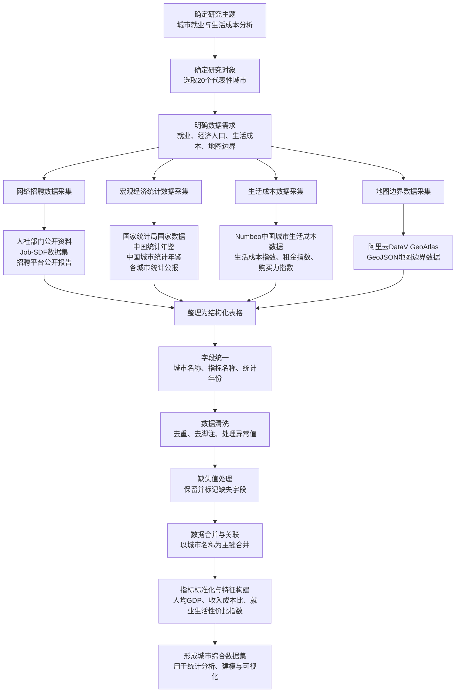

# 数据采集方法与流程图

## 图题建议

图 2-1 数据采集方法与流程图

## 报告正文引用示例

本文的数据采集流程如图 2-1 所示。首先确定研究主题和研究城市，然后根据就业、经济人口、生活成本和地图边界等分析需求分别采集数据。随后将不同来源的数据整理为结构化表格，并进行字段统一、数据清洗、缺失值处理和数据合并，最终形成城市综合数据集，为后续统计分析、建模和可视化展示提供数据基础。
